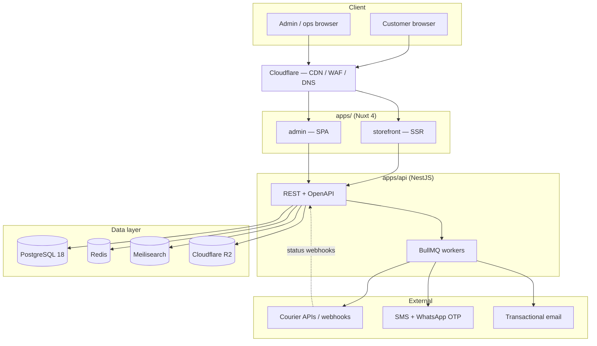
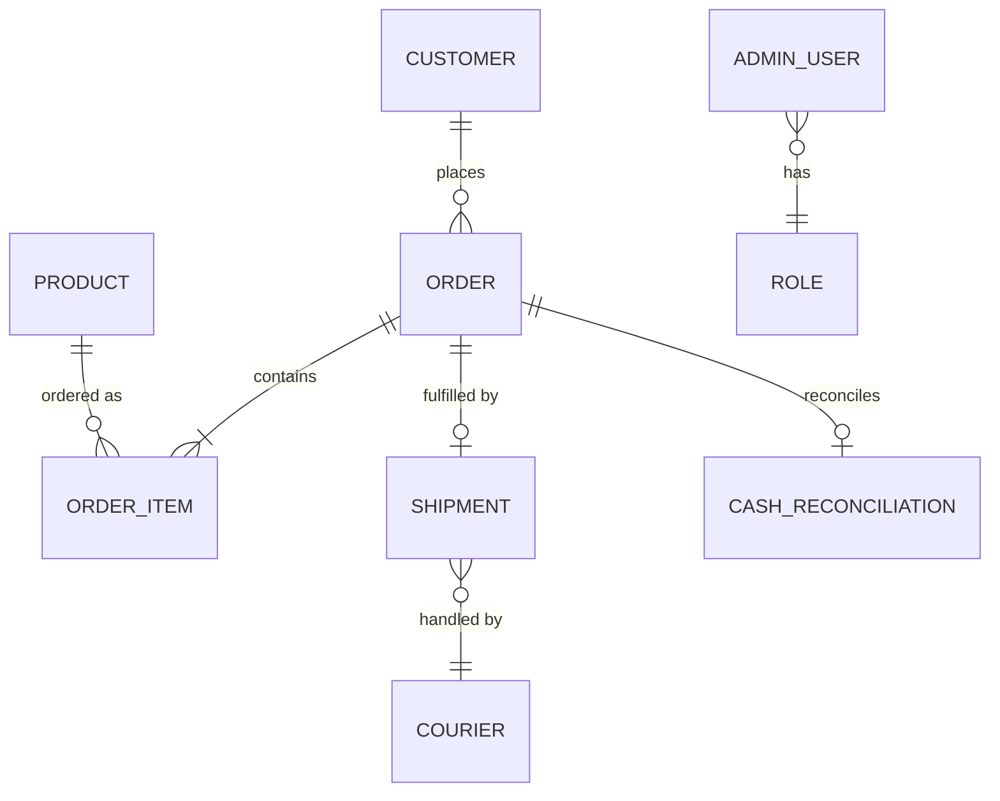
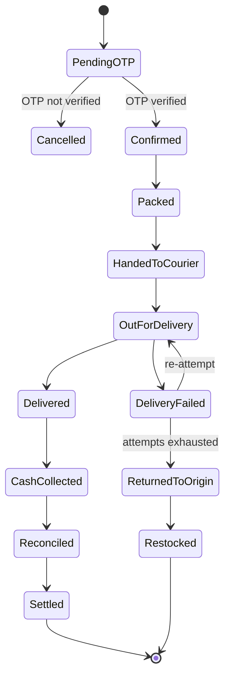

# COD Storefront & Operations — Build Plan

Architecture and phased build plan for a single-store cash-on-delivery (COD) e-commerce site with a full back-office management system. Nuxt front end, third-party courier fulfillment, growth-stage infrastructure.

**Scope:** single-vendor storefront · **Fulfillment:** third-party courier · **Target:** growth-stage scale
**Prepared:** 2026-07-17 — versions below are latest-stable as of this date; re-check before scaffolding, this stack moves fast.

## Contents

1. [Stack decisions](#1-stack-decisions)
2. [Stack versions](#2-stack-versions)
3. [System architecture](#3-system-architecture)
4. [Front end & design system](#4-front-end--design-system)
5. [Backend & API](#5-backend--api)
6. [Database & data layer](#6-database--data-layer)
7. [Order lifecycle & COD logic](#7-order-lifecycle--cod-logic)
8. [Management system](#8-management-system)
9. [Courier integration](#9-courier-integration)
10. [Infrastructure & deployment](#10-infrastructure--deployment)
11. [Security & risk controls](#11-security--risk-controls)
12. [Phased roadmap](#12-phased-roadmap)

---

## 1. Stack decisions

| Layer | Choice | Why |
|---|---|---|
| Front end framework | **Nuxt 4** | Given, per brief. Better project structure (`app/` dir), smarter data fetching, and improved type safety over Nuxt 3. |
| Design system / UI | **Nuxt UI v4** (Tailwind CSS v4 + Reka UI) | First-party Nuxt maintenance — no adapter friction with SSR/auto-imports. v4 merged the old Pro tier in for free: 100+ components covering both a marketing storefront and a dense admin dashboard from one theme. |
| Backend framework | **NestJS** (Node.js + TypeScript) | Shares types with Nuxt across a monorepo; modular DI architecture fits a stateful domain (orders, reconciliation, courier adapters) better than a thin framework. |
| Primary database | **PostgreSQL 18** | Cash reconciliation and order data are relational and need ACID guarantees — ledger correctness matters more than schema flexibility here. |
| Supporting data services | **Redis** (cache/queues) · **Meilisearch** (product search) · **Cloudflare R2** (object storage) | Each is a narrow, well-scoped job — none belong in Postgres, none justify a heavier alternative (Elasticsearch, S3 egress fees) at this stage. |

---

## 2. Stack versions

Pin these at scaffold time; treat this table as a starting point, not gospel — verify against each project's release page before `create-nuxt`/`nest new`.

| Package | Latest stable (2026-07) | Note |
|---|---|---|
| Nuxt | 4.4.x | Nuxt 4.0 shipped mid-2025; 4.4 (Mar 2026) added typed layout props, smarter payload handling |
| Nuxt UI | 4.9.x | v4 unified Nuxt UI + Nuxt UI Pro into one free package |
| Tailwind CSS | 4.2.x | Ships as Nuxt UI v4's styling engine |
| Node.js | 24.x (Active LTS) | Node 22 is Maintenance LTS and still fine; avoid Node 26 (Current, not yet LTS) for production until Oct 2026 |
| NestJS | 11.1.x | v12 (ESM migration, Vitest, Standard Schema validation) is in draft for Q3 2026 — don't start a new project on it yet |
| TypeScript | 7.0.x | Just went GA (July 2026), Go-native compiler, ~10x faster builds. Brand new — spot-check editor/lint tooling compatibility before committing a whole team to it; TS 5.x is a safe fallback if anything in your toolchain hasn't caught up |
| PostgreSQL | 18.x | v19 is in beta, GA expected September 2026 — not for production yet |
| Prisma | 7.4.x | Rust-free engine, faster cold starts than Prisma 5/6 |
| Redis | 8.x | — |

---

## 3. System architecture

Monorepo layout: `apps/storefront`, `apps/admin`, `apps/api`, with `packages/shared` (Zod schemas + TS types used by both Nuxt apps and NestJS) and `packages/ui` (shared Nuxt UI theme tokens) — managed with **pnpm workspaces + Turborepo** so CI only rebuilds what changed.

---

## 4. Front end & design system

### Design system / UI framework — Nuxt UI v4

Nuxt UI (v4, Tailwind CSS v4 + Reka UI primitives) is the pick. It's maintained by the Nuxt core team, so auto-imports, SSR hydration, and Nuxt DevTools all work without adapter friction — the risk with third-party Vue kits. As of v4 it gives you both registers you need for free: marketing-grade blocks for the storefront, and dense, accessible primitives (data tables, command palette, forms, slideovers) for the admin back office — from a single themeable token set instead of two design languages.

| Option | Fit for this project | Verdict |
|---|---|---|
| **Nuxt UI v4** | First-party, Tailwind-based, one kit spans storefront + admin, best Nuxt 4 DX, Pro components now free | **Chosen** |
| Vuetify | Mature, but Material Design look needs heavy overriding to feel brand-specific; SSR setup is more manual | Passed |
| PrimeVue | Excellent component breadth for admin grids, but weaker Nuxt-native integration and a dated default aesthetic | Passed |
| Element Plus | Strong for admin panels alone, but you'd still need a second kit for the storefront | Passed |

### Supporting front-end choices

| Concern | Choice |
|---|---|
| State | Pinia |
| Data fetching | `useFetch` / `$fetch`, TanStack Query in admin for complex caching |
| Forms + validation | Nuxt UI forms + Zod (schema shared with the API via `packages/shared`) |
| Images | `@nuxt/image` over Cloudflare R2 |
| i18n | `@nuxtjs/i18n` if multi-region |
| Rendering mode | SSR for the storefront (SEO-critical), SPA for admin |

---

## 5. Backend & API

NestJS over REST, documented with OpenAPI. GraphQL isn't worth the added complexity here — the admin UI's query needs are well served by well-designed REST endpoints plus TanStack Query caching.

| Option | Trade-off | Verdict |
|---|---|---|
| **NestJS (Node/TS)** | Shares types with Nuxt via a monorepo package; modular DI suits a stateful order/reconciliation domain; native BullMQ support | **Chosen** |
| Laravel (PHP) | Fast CRUD scaffolding, but splits the stack's language and tooling from the Nuxt/TS front end | Passed |
| Go (Fiber/Gin) | Best raw throughput, but slower iteration speed on CRUD-heavy admin screens and a smaller talent pool for fast early hiring | Passed |
| Django | Admin panel is tempting, but a Python service alongside a TS front end fragments the stack for no real gain here | Passed |

Structure the API in domain modules — `catalog`, `orders`, `fulfillment`, `reconciliation`, `identity`, `notifications` — so a module can later be split into its own service (e.g. reconciliation) without a rewrite, without paying for microservices complexity up front.

---

## 6. Database & data layer

| Layer | Technology | Role |
|---|---|---|
| Primary store | PostgreSQL 18 (managed) | Orders, customers, products, shipments, cash reconciliation ledger — anything needing ACID + relational integrity |
| ORM | Prisma 7 (Drizzle as a fallback) | Type-safe schema + migrations; Drizzle is the option if you later need lower-level SQL control for reconciliation-heavy queries |
| Cache / queues | Redis + BullMQ | Session/cache, courier webhook processing, OTP throttling, notification jobs, report generation |
| Search | Meilisearch | Product catalog search/typeahead — self-hostable, far cheaper to operate than Elasticsearch or Algolia at this scale |
| Object storage | Cloudflare R2 | Product images, invoices, proof-of-delivery photos — S3-compatible API, no egress fees |

Postgres over MongoDB as the primary store because the hardest problem in this system — matching COD cash collected by a courier against what an order actually owes — is a ledger problem, and ledgers want foreign keys and transactions, not document flexibility.

### Core entities

---

## 7. Order lifecycle & COD logic

The state machine below is the spine of the whole system — every admin screen and background job exists to move an order along it or report on where it's stuck.

> **COD-specific risk:** Return-to-origin (RTO) and fake/failed COD orders are the two costs that erode margin fastest in this model. Both get designed for from day one rather than bolted on later: phone OTP at checkout, a risk score per customer built from delivery-failure history, and an optional partial-prepayment gate for flagged customers.

### Cash reconciliation

- Every `Delivered` order carries an expected COD amount; every courier remittance batch reports what was actually collected.
- A reconciliation job matches remittances to orders by courier reference ID, flags mismatches for finance review, and only marks an order `Settled` once matched.
- All reconciliation edits are written to an append-only audit log — this is the one table in the system nobody gets to hard-delete from.

---

## 8. Management system

Built as `apps/admin`, same Nuxt UI theme as the storefront, role-gated at the route and API level.

| Role | Owns |
|---|---|
| Super Admin | Users, roles, catalog, site configuration, integrations |
| Ops Manager | Order queue, packing/dispatch, courier assignment, RTO handling |
| Finance | Cash reconciliation, courier remittance matching, settlement reports |
| Support | Order lookup, customer contact, refund/replacement requests |
| Warehouse | Inventory levels, stock-in/out, low-stock alerts |

### Storefront (customer-facing)

- Catalog with search (Meilisearch), filters, and product detail pages
- Cart and COD checkout with phone OTP verification
- Order tracking by phone/order ID, order history for returning customers
- Transactional SMS/WhatsApp/email at each major state change

---

## 9. Courier integration

Since fulfillment goes to a third-party courier company, the API defines a single internal `CourierProvider` interface — `createShipment`, `getStatus`, `cancelShipment`, `parseWebhook` — and one adapter implementation per courier. Adding or switching couriers later is a new adapter, not a rewrite of the order module.

- Inbound courier status webhooks normalize provider-specific codes into the internal order state machine (§7).
- A polling fallback job (BullMQ, hourly) covers couriers with unreliable webhooks.
- Courier performance (on-time delivery rate, RTO rate) is tracked per provider to support renegotiating or multi-sourcing later.

---

## 10. Infrastructure & deployment

Since you're building for growth rather than a weekend MVP, the goal is a 12-factor app from day one — config via environment, stateless API containers, no server-local file writes — so scaling later is an infra change, not an application rewrite.

| Concern | Start | Scale-out path |
|---|---|---|
| Nuxt apps | Vercel or Cloudflare (NuxtHub) — edge SSR, zero-ops | Same; both scale horizontally without app changes |
| API + workers | Docker on Railway / Render / Fly.io | AWS ECS Fargate once traffic justifies the extra ops overhead |
| Postgres | Neon or managed Postgres, single primary | Read replicas, then RDS/Aurora with connection pooling (PgBouncer) |
| Redis | Upstash (serverless) | AWS ElastiCache cluster mode |
| CDN / WAF | Cloudflare in front of everything | Unchanged — also your first line of defense against COD order-spam bots |

- **CI/CD:** GitHub Actions, Turborepo affected-only builds
- **Errors:** Sentry, front and back end
- **Logs / uptime:** Better Stack or Grafana Cloud
- **Backups:** daily automated + point-in-time recovery

---

## 11. Security & risk controls

- **No card data to protect** — COD checkout means no PCI scope for payments, which simplifies the security surface considerably.
- **Phone OTP** at checkout, rate-limited, as the primary anti-fraud gate — the single highest-leverage control against fake COD orders.
- **RBAC** enforced server-side per module (§8), not just hidden in the admin UI.
- **Immutable audit log** on order-status and reconciliation changes — required for any finance dispute to be resolvable after the fact.
- **PII at rest** — encrypt customer phone numbers and addresses; scope access to the roles that need them (Support, Ops), not Finance or Warehouse.
- **Rate limiting** on public endpoints (checkout, OTP request/verify) at the Cloudflare edge and again in NestJS.

---

## 12. Phased roadmap

Roughly 11–16 weeks to a solid v1 with a small dedicated team (2–4 engineers), assuming the phases below run mostly sequentially with some overlap.

| Weeks | Phase | Scope |
|---|---|---|
| 1–2 | **0 — Foundations** | Monorepo scaffold, Nuxt UI theme tokens, CI/CD, environments, auth skeleton, Postgres schema v1 |
| 3–6 | **1 — MVP storefront + checkout** | Catalog, cart, OTP-gated COD checkout, order confirmation, basic admin order list/status updates, SMS/email notifications |
| 7–10 | **2 — Fulfillment & ops** | Courier adapter integration, shipment tracking, webhook status sync, warehouse packing flow, RTO/returns handling |
| 11–13 | **3 — Cash reconciliation** | COD collection tracking, courier remittance matching, discrepancy flags, finance settlement reports |
| 14–16 | **4 — Risk & scale hardening** | Fraud/risk scoring, Meilisearch rollout, caching and perf pass, load testing, alerting |
| Ongoing | **5 — Growth iteration** | Analytics dashboards, multi-warehouse inventory, coupons/campaigns, experimentation |
